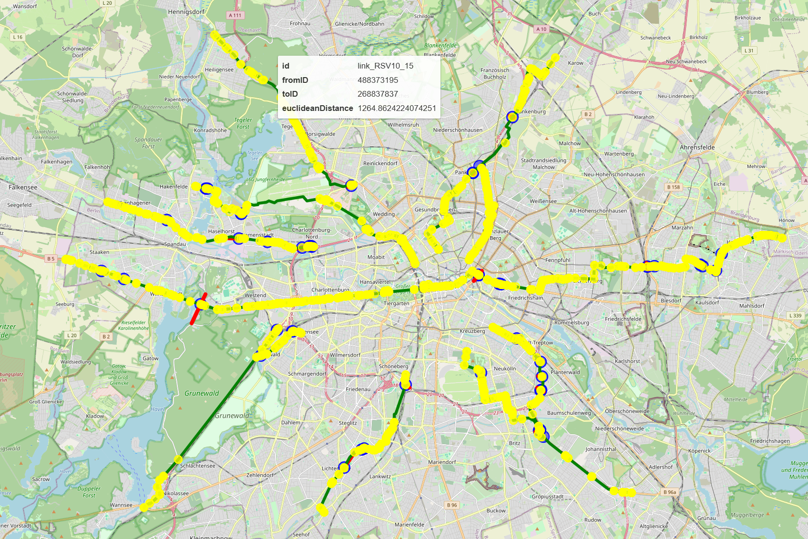
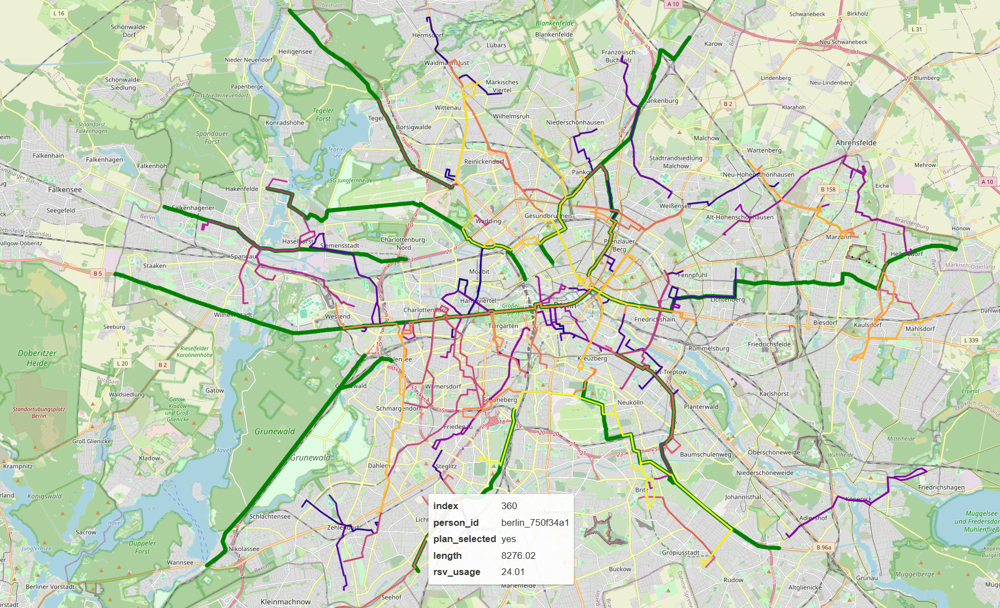
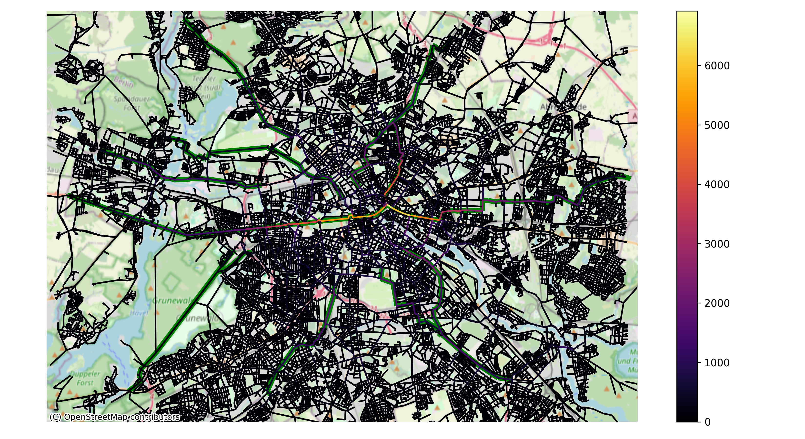

## Overview

This repository contains the Python-code of this project.
The JAVA-code can be found [here](https://github.com/benbaute/matsim-berlin).

## Creating a network file with cycle-highways

The creation can be skipped by downloading the [network file with cycle-highways](https://tubcloud.tu-berlin.de/s/2FkQE9FsDWRmP5s).
To create the network file on your own. Follow the following steps:

1. Download the [network file](https://svn.vsp.tu-berlin.de/repos/public-svn/matsim/scenarios/countries/de/berlin/berlin-v6.4/input/berlin-v6.4-network-with-pt.xml.gz) and put it in the [input v6.4 folder](https://github.com/benbaute/matsim-berlin/tree/main/input/v6.4) on your machine.
2. [Export](https://github.com/benbaute/matsim-berlin/blob/main/src/main/java/org/matsim/run/ExportCycleNetwork.java) only the nodes and links relevant for bikes.
   To do this [exportCycleHighways](https://github.com/benbaute/matsim-berlin/blob/main/src/main/java/org/matsim/run/ExportCycleNetwork.java#L17) must be set to false.
   This produces the file bike-network.xml in the [network](https://github.com/benbaute/matsim-berlin/tree/main/output/network) folder.
3. [Extract](nodes_and_links_from_network.py) nodes and links.
   To do this export_cycle_highways must be set to False, and a bike folder must be added to the [network](https://github.com/benbaute/matsim-berlin/tree/main/output/network) folder.
   This produces bike-links.geojson and bike-nodes.geojson in the bike folder.
4. Create cycle-highways and intersections with the MATSim network with [qgis](https://qgis.org/). This step can be skipped by using the available [output](https://github.com/benbaute/matsim-berlin/tree/main/output/network/qgis-output).
   This produces the files snapped-cycle-highways.geojson, self-intersections.geojson, cycle-highways.geojson, and bike-network-intersections.geojson.

   cycle-highways contains the drawn cycle highways.\
   snapped-cycle-highways contains the cycle highways snapped to the MATSim links.\
   bike-network-intersections contains intersection points where the snapped cycle highways intersect with the MATSim links.\
   self-intersections contains intersection points where the snapped cycle highways intersect with other snapped cycle highways.
5. [Adjust](bike_network_adjustments.py) the current network by snapping bike-network-intersections to bike-nodes.
   This produces the files intersection_nodes.geojson, new_matsim_links_network_intersections.geojson, and new_matsim_nodes_network_intersections.geojson in the [python](https://github.com/benbaute/matsim-berlin/tree/main/output/network/python) folder.

   intersection_nodes contains the snapped nodes.\
   new_matsim_links_network_intersections contains new MATSim links based on the intersections. These are calculated by splitting the current MATSim links at the intersections.\
   new_matsim_nodes_network_intersections contains new nodes that have to be added to the MATSim network.
6. [Create](cycle_highway_links.py) new MATSim links based on snapped-cycle-highways, intersection_nodes, and self-intersections. This produces the files new_matsim_links_cycle_highways.geojson and new_matsim_nodes_combined.geojson in the [python](https://github.com/benbaute/matsim-berlin/tree/main/output/network/python) folder.
 
   new_matsim_links_cycle_highways contains new MATSim links based on the drawn cycle-highways.\
   new_matsim_nodes_combined contains new_matsim_nodes_network_intersections combined with the new nodes added through cycle-highways intersecting with themselves.
7. [Apply](https://github.com/benbaute/matsim-berlin/blob/main/src/main/java/org/matsim/run/CycleHighways.java) the changes to the network file. This produces the file berlin-v6.4-network-with-pt-and-cycle-highways.xml in the [input v6.4 folder](https://github.com/benbaute/matsim-berlin/tree/main/input/v6.4) folder.

## Analysis

* The file [Explore Network](explore_network.py) creates an interactive map of the network creation results.
  The [html](output/map.html) file can be opened in any browser.
  It visualizes the new cycle highway links, intersection with the available Matsim network,
  new intersections, and the split links.

* The file [Explore Plans](explore_plans.py) displays the plans chosen by the cyclists.
  It was used for debugging purposes to see whether appropriate routes were chosen.
  It uses the filtered data of the file [Extract Paths](extract_paths.py).
  This works fine with a small population.
  With a big population the plans file is bigger than 1GB which is too big for Python to easily handle.
  In that case the file would have to be read in, in parts.

* The file [Link Analysis](link_analysis.py) creates a heatmap for a run 
  depending on how many bikes used a particular link.
  The map is created as both an image and as an interactive map.
  The interactive map can only handle a certain amount of links while working smoothly. 
  The links can be filtered accordingly.

## Screenshots

